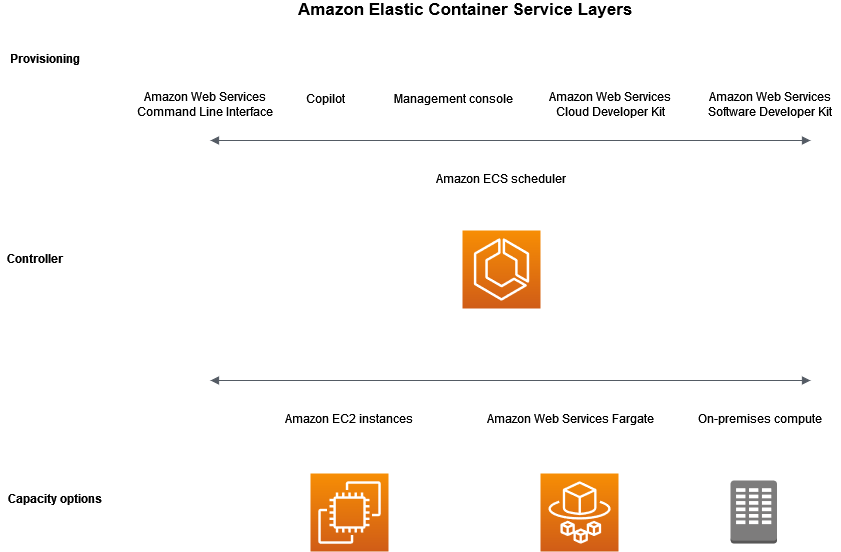

### **What is Amazon Elastic Container Service?**
Amazon Elastic Container Service (Amazon ECS) is a fully managed container orchestration service that helps you easily deploy, manage, and scale containerized applications.

#### ECS terminology and components:

- Capacity Providers (Fargate, EC2): The infrastructure on which your containers run.
- Controller - Deploy and manage your applications that run on containers.
- Provisioning - The tools that you can to inter
The following diagram shows the Amazon ECS layers.

- **Cluster**: A logical grouping of container instances that run your applications.
- **Task Definition**: A blueprint for your application that defines container settings, networking, and storage.
- **Service**: A configuration that enables you to run and maintain a specified number of instances of a task definition.
- **Container Instance**: A host running the ECS agent and Docker daemon, capable of running containers.
- **Task**: An instantiation of a task definition within a cluster.
- **Container**: A Docker container running on a container instance.
